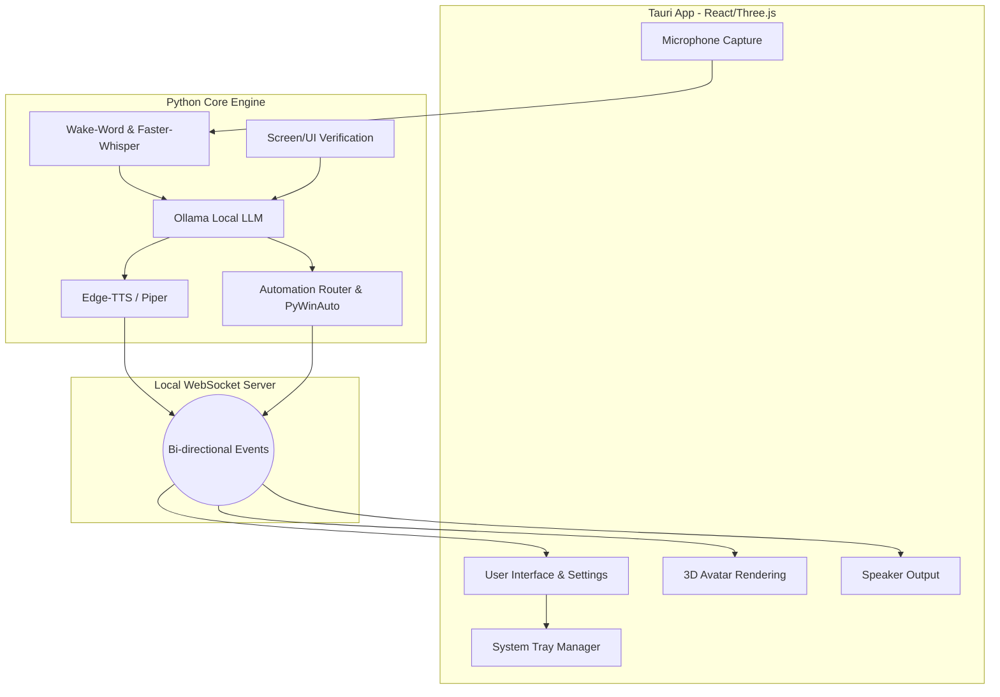

# Omnix: Next-Generation Implementation Plan
**From-Scratch Development Guide**

## 1. Project Vision
Omnix is a downloadable, voice-first, natural-language AI desktop agent. It understands human goals, operates a Windows computer directly, and communicates naturally with the user through a real-time 3D avatar. 

Most importantly, this architecture is designed to be **100% Free and Local**. By utilizing local Large Language Models (LLMs) and open-source tooling, there are zero recurring API costs, and user data never leaves their machine.

---

## 2. Technology Stack

### The Brain & Logic (Backend)
* **Language:** Python 3.13.15 (for optimal async performance and speed).
* **LLM Engine (Multi-Provider):** 
  * **Local (Free):** [Ollama](https://ollama.com/) running models like Llama-3 8B.
  * **Premium Cloud (Optional):** OpenAI (ChatGPT), Anthropic (Claude), and Google (Gemini) support built directly in. Users can switch dynamically from the Settings UI.
* **Emotion Engine:** The LLM generates real-time emotional states (`happy`, `confused`, etc.) in a JSON response, which dictates voice pitch and 3D avatar facial blendshapes.
* **Speech-to-Text (Ears):** `faster-whisper` for ultra-fast, local voice transcription.
* **Text-to-Speech (Mouth):** `edge-tts` (Microsoft's free neural voices) or `Piper` for high-quality offline voice synthesis.
* **OS Automation (Hands):** `pyautogui` (mouse/keyboard), `pywinauto` (Windows UI interaction).
* **Perception (Eyes):** `pytesseract` (OCR) and OpenCV for screen reading.

### The App & 3D Avatar (Frontend)
* **Desktop Framework:** [Tauri](https://tauri.app/). Chosen over Electron because it uses native webviews (Rust-based), saving massive amounts of RAM for the local LLM.
* **UI Framework:** React.js with Tailwind CSS for modern, sleek styling.
* **3D Engine:** `three.js` combined with `@react-three/fiber` for rendering the avatar.
* **3D Assets:** [Ready Player Me](https://readyplayer.me/) for free, rigged 3D `.glb` avatars, and [Mixamo](https://www.mixamo.com/) for free animations (talking, idle, listening).

### Communication Bridge
* **Protocol:** `websockets` (Python `websockets` library + browser native WebSocket API) for millisecond-latency streaming of text, audio, and commands.

---

## 3. System Architecture

Omnix uses a decoupled "Split Architecture" to ensure the heavy AI processing doesn't freeze the user interface.

---

## 4. The Real-Time Execution Loop
To achieve simultaneous speaking and acting (e.g., *"Open Spotify and play Believer"*):

1. **Listen:** Backend constantly listens. User speaks command.
2. **Understand:** `faster-whisper` transcribes the text; Ollama parses it into JSON actions: `[{"action": "open", "target": "Spotify"}, {"action": "play", "target": "Believer"}]`.
3. **Parallel Execution:**
   * **Thread 1 (Voice):** Python generates TTS: "I'm opening Spotify and playing Believer." The audio buffer is streamed via WebSockets to the Tauri app. The 3D model immediately plays the audio and maps mouth movements (visemes) to the sound.
   * **Thread 2 (Action):** Simultaneously, Python hooks into the OS, launches `Spotify.exe`, clicks the search bar, types "Believer", and hits play.
4. **Verification:** The backend takes a quick UI check to confirm Spotify is playing music, then returns to an idle state.

---

## 5. Development Phases

### Phase 1: The Core Brain & Voice (Python Backend)
* Initialize a clean Python project.
* Set up Ollama locally and design the prompt architecture that converts natural language into structured PC commands.
* Integrate `faster-whisper` for STT.
* Integrate TTS and write a script to generate and play back audio instantly.

### Phase 2: The Hands & Eyes (Automation System)
* Build modular "Capabilities" in Python (e.g., `browser_automation.py`, `spotify_automation.py`, `system_automation.py`).
* Implement the feedback loop: Action -> Screen Read (PyWinAuto/OCR) -> Success/Failure verification.

### Phase 3: The 3D UI & Desktop App (Frontend)
* Scaffold a new Tauri + React project.
* Build the frameless window layout.
* Implement `react-three-fiber` to load a default `.glb` avatar.
* Add idle animations to the 3D model.
* Build the App Settings page (Toggle 3D model, change voices, set wake words).

### Phase 4: The Nervous System (WebSocket Bridge)
* Spin up a WebSocket server in the Python backend.
* Connect the Tauri React app to the WebSocket.
* Implement real-time lip-syncing: When the frontend receives an audio buffer from Python, it plays the audio and triggers the avatar's "Talking" animation.

### Phase 5: Polish & System Integration
* Implement **System Tray** logic in Tauri (app hides instead of quits, background listening remains active).
* Add "Floating Mode" (making the Tauri window background transparent so the avatar stands directly on the desktop wallpaper).

### Phase 6: Packaging & Distribution
* Compile the Python backend into a standalone executable using `PyInstaller`.
* Configure the Tauri bundler to include the compiled Python `.exe` as a "sidecar".
* Build the final `.msi` (Windows) or `.exe` installer. When the user installs and runs Omnix, Tauri will seamlessly launch the Python backend in the background.
